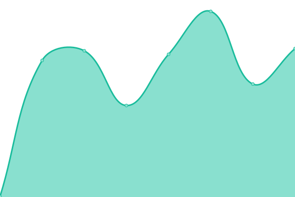
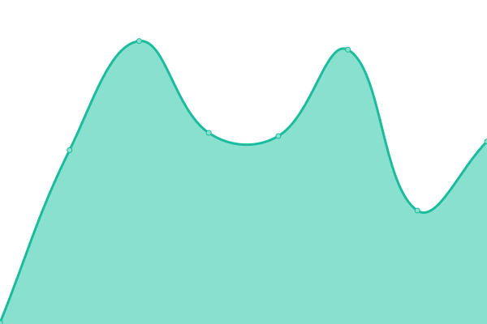

# [📈 Live Status](https://uptime-status.zebec.io): <!--live status--> **🟩 All systems operational**

This repository contains the open-source uptime monitor and status page for [Zebec Protocol](https://zebec.io), powered by [Upptime](https://github.com/upptime/upptime).

With [Upptime](https://upptime.js.org), you can get your own unlimited and free uptime monitor and status page, powered entirely by a GitHub repository. We use [Issues](https://github.com/zebec-protocol/zebec-protocol-status/issues) as incident reports, [Actions](https://github.com/zebec-protocol/zebec-protocol-status/actions) as uptime monitors, and [Pages](https://uptime-status.zebec.io) for the status page.

<!--start: status pages-->
<!-- This summary is generated by Upptime (https://github.com/upptime/upptime) -->
<!-- Do not edit this manually, your changes will be overwritten -->
<!-- prettier-ignore -->
| URL | Status | History | Response Time | Uptime |
| --- | ------ | ------- | ------------- | ------ |
|  [Landing Page](https://zebec.io/) | 🟩 Up | [landing-page.yml](https://github.com/Zebec-protocol/zebec-protocol-status/commits/HEAD/history/landing-page.yml) | 

 240ms
     
 | 

<a href="https://status.zebec.io/history/landing-page">100.00%</a>
    

|  [Application](https://app.zebec.io/) | 🟩 Up | [application.yml](https://github.com/Zebec-protocol/zebec-protocol-status/commits/HEAD/history/application.yml) | 

 299ms
     
 | 

<a href="https://status.zebec.io/history/application">100.00%</a>
    

|  [API](http://api-v2.zebec.io/ht/) | 🟩 Up | [api.yml](https://github.com/Zebec-protocol/zebec-protocol-status/commits/HEAD/history/api.yml) | 

 267ms
     
 | 

<a href="https://status.zebec.io/history/api">100.00%</a>
    

|  [Legacy API](https://api.zebec.io/) | 🟩 Up | [legacy-api.yml](https://github.com/Zebec-protocol/zebec-protocol-status/commits/HEAD/history/legacy-api.yml) | 

 140ms
     
 | 

<a href="https://status.zebec.io/history/legacy-api">100.00%</a>
    

|  [Legacy Dashboard](https://dashboard.zebec.io/) | 🟩 Up | [legacy-dashboard.yml](https://github.com/Zebec-protocol/zebec-protocol-status/commits/HEAD/history/legacy-dashboard.yml) | 

 219ms
     
 | 

<a href="https://status.zebec.io/history/legacy-dashboard">94.82%</a>
    

<!--end: status pages-->

[**Visit our status website →**](https://uptime-status.zebec.io)

## 📄 License

- Powered by: [Upptime](https://github.com/upptime/upptime)
- Code: [MIT](./LICENSE) © [Zebec Protocol](https://zebec.io)
- Data in the `./history` directory: [Open Database License](https://opendatacommons.org/licenses/odbl/1-0/)
